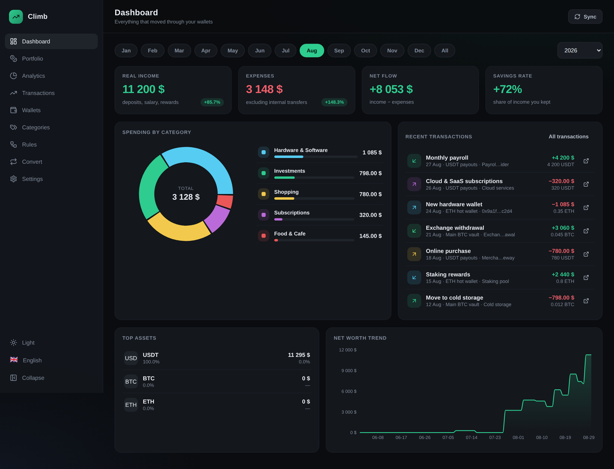
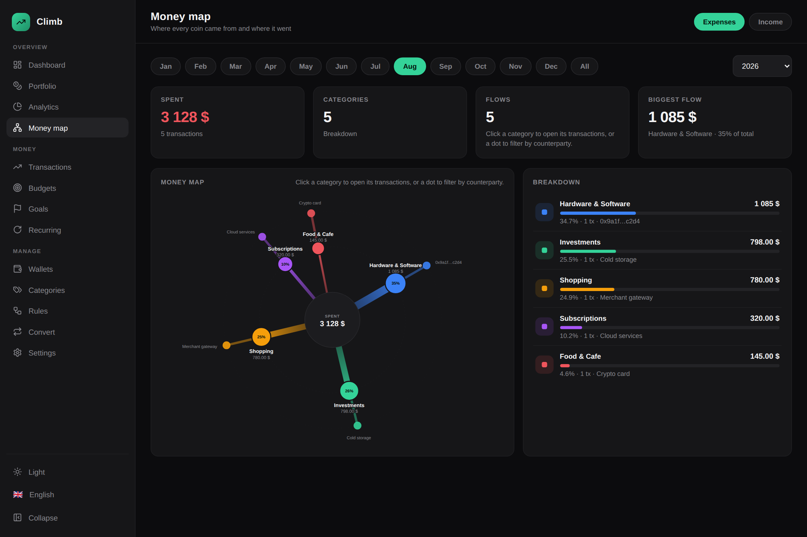
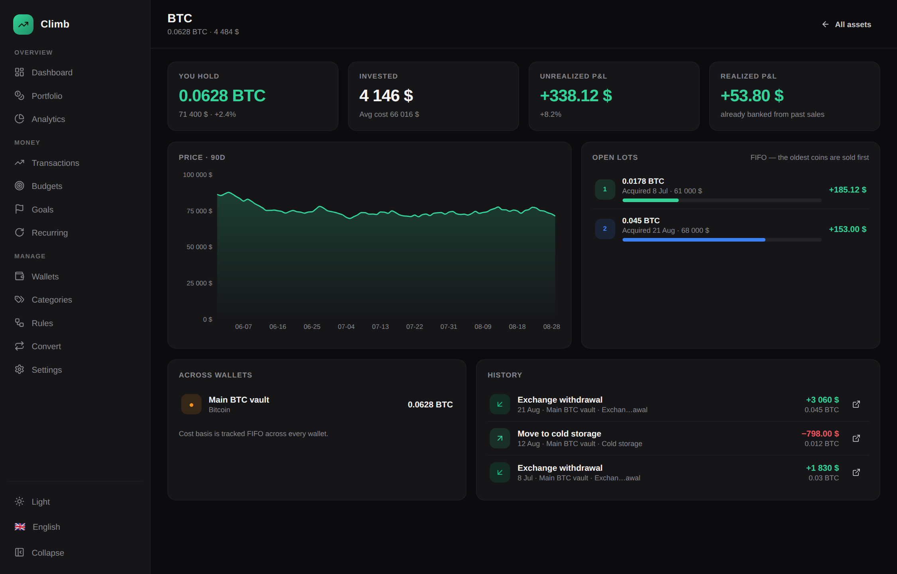
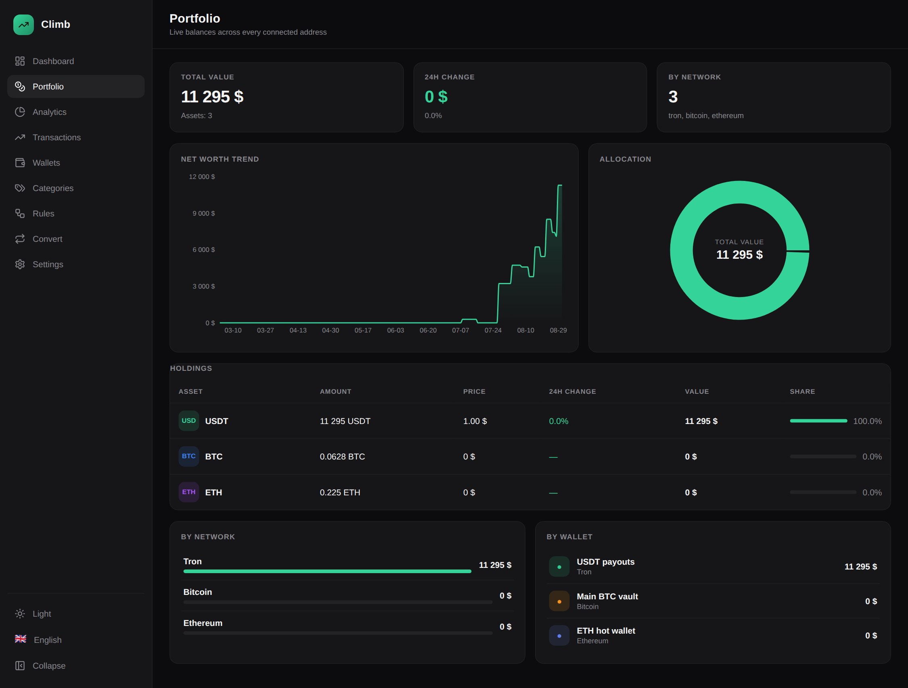
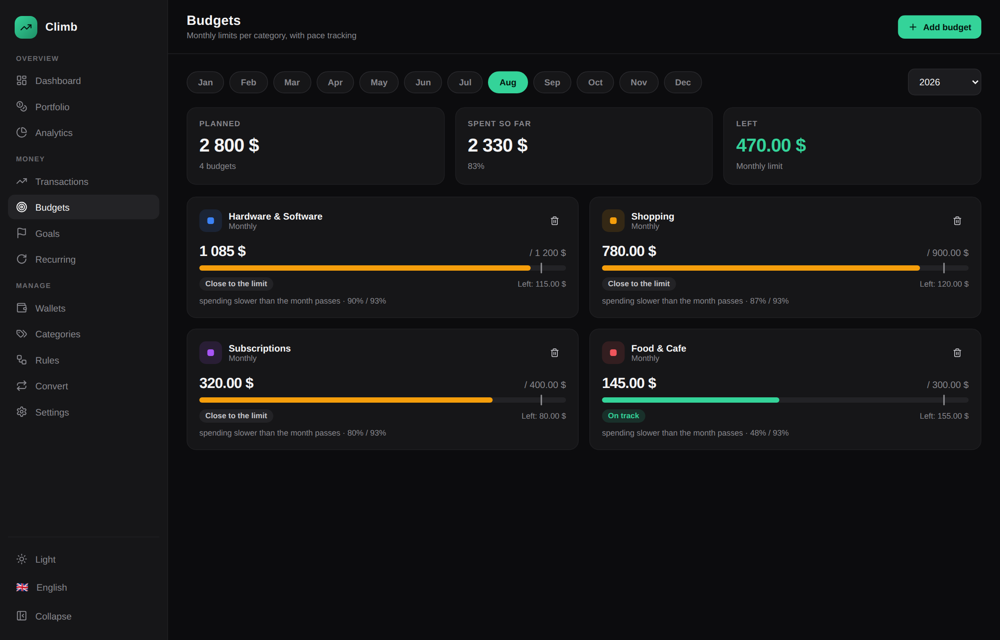
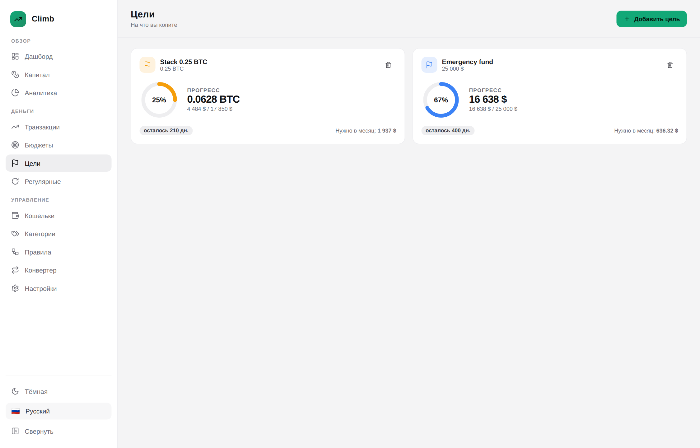
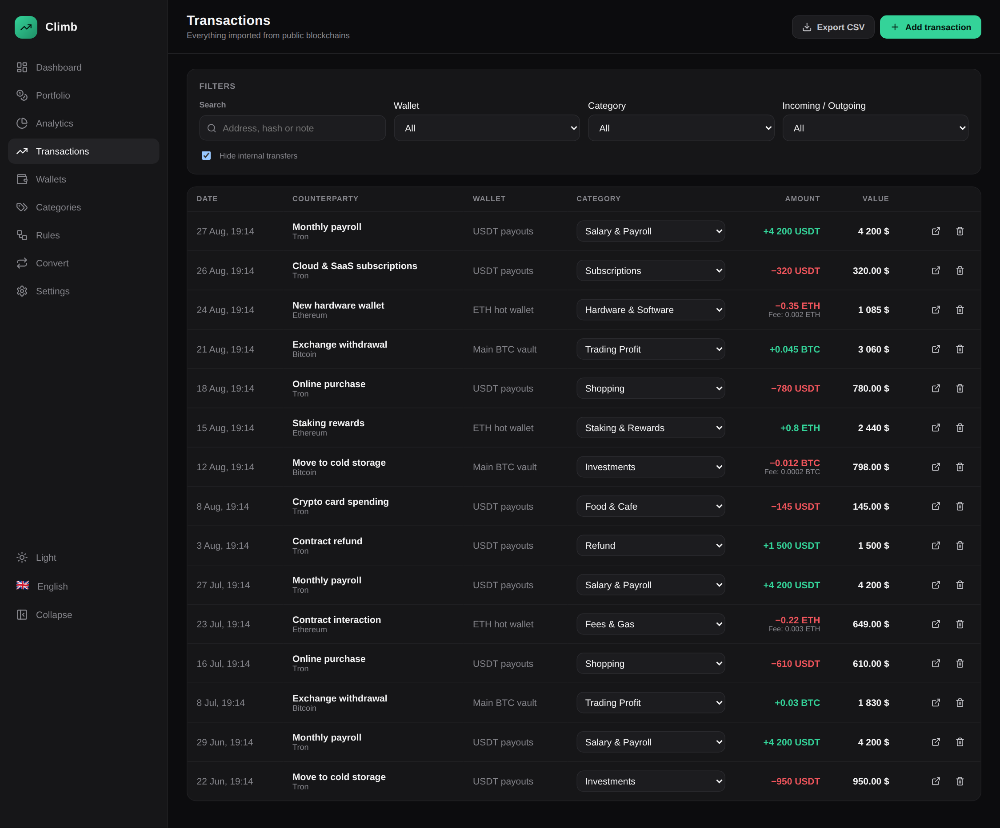
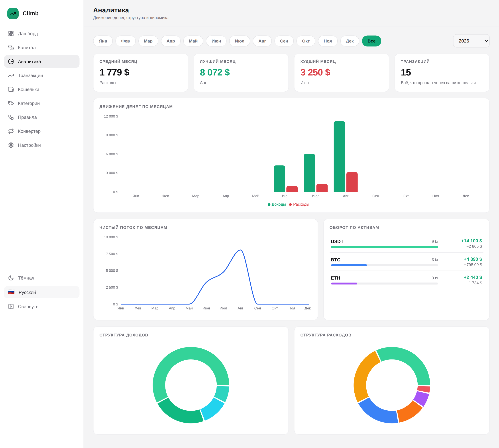

<div align="center">


# Climb

**English · [Русский](README.ru.md)**

### A self-hosted dashboard for tracking crypto wallets, spending and net worth

Connect any **public** address — Bitcoin, Ethereum, Polygon, Arbitrum, Base, Optimism, TRON, Solana —
and Climb turns raw on-chain activity into a finance dashboard: **FIFO cost basis and realized /
unrealized P&L**, an interactive **money map** of where everything went, budgets, savings goals,
detected recurring payments, cash flow and live conversion rates.


<br />



</div>

---

## Why Climb

- **Real P&L, not just balances** — every incoming movement opens a lot, every outgoing one closes
  lots oldest-first. You get average cost, cost basis, unrealized and realized profit per asset —
  the numbers a portfolio tracker exists for, computed across all your wallets at once.
- **Watch-only by design** — you paste a public address, nothing else. Climb has no place to put a
  seed phrase or a private key, and it will refuse anything that looks like one.
- **Your data never leaves your machine** — a Postgres container you own holds every wallet,
  transaction and setting. No account, no cloud, no telemetry.
- **Built for spending too** — categories, automatic rules, internal-transfer detection, budgets
  with pace tracking, savings goals and recurring-payment detection, the way a personal-finance
  app works.
- **Multi-chain from one screen** — eight networks, native coins, ERC-20 / TRC-20 stablecoins and
  SPL tokens in a single portfolio.
- **Two themes, two languages** — dark and light, English and Russian, switched from the sidebar
  and remembered per instance. New languages are one file.
- **One command to run** — `docker compose up -d`, and the dashboard is on `localhost:8080`.

---

<div align="center">



<sub><b>The money map</b> — every category and counterparty of a period on one canvas</sub>

</div>

---

## Screenshots

<table>
<tr>
<td width="50%"><br /><sub><b>Per-asset P&amp;L</b> — average cost, unrealized and realized profit, every open FIFO lot</sub></td>
<td width="50%"><br /><sub><b>Portfolio</b> — holdings with cost basis, P&amp;L and allocation</sub></td>
</tr>
<tr>
<td width="50%"><br /><sub><b>Budgets</b> — limits per category with a pace marker</sub></td>
<td width="50%"><br /><sub><b>Goals</b> — light theme, Russian locale</sub></td>
</tr>
<tr>
<td width="50%"><br /><sub><b>Transactions</b> — filters, inline categories, CSV export</sub></td>
<td width="50%"><br /><sub><b>Analytics</b> — cash flow and structure</sub></td>
</tr>
</table>

---

## Quick start

```bash
git clone https://github.com/SpecFlowdev/climb.git
cd climb
cp .env.example .env      # optional — every value already has a default
docker compose up -d
```

Open **http://localhost:8080**. The database schema is created on the first start,
so there is no migration step to run.

Want to see the dashboard populated before adding your own addresses? Set `DEMO_MODE=true`
in `.env` before the first start and Climb seeds a realistic sample portfolio.

```bash
docker compose logs -f app     # follow the API log
docker compose down            # stop, keep the data
docker compose down -v         # stop and delete the database volume
```

---

## Supported networks

| Network | Native | Tokens | Data source |
| --- | --- | --- | --- |
| Bitcoin | BTC | — | Blockstream Esplora |
| Ethereum | ETH | ERC-20 (USDT, USDC, DAI…) | Blockscout |
| Polygon | POL | ERC-20 | Blockscout |
| Arbitrum One | ETH | ERC-20 | Blockscout |
| Base | ETH | ERC-20 | Blockscout |
| Optimism | ETH | ERC-20 | Blockscout |
| TRON | TRX | TRC-20 (USDT…) | TronGrid |
| Solana | SOL | SPL (USDC, USDT…) | Solana JSON-RPC |

Every source works without an API key. Keys only raise the rate limits — drop them into `.env`
when you sync many wallets. Prices come from CoinGecko; stablecoins fall back to $1 when the
market API is unreachable, so the dashboard never goes blank.

---

## Features

**Dashboard**
- Real income, expenses, net flow and savings rate for any month or the whole year
- Comparison badges against the previous period
- Spending donut with a ranked category list
- Recent transactions with explorer links, top assets and a 90-day net-worth curve

**Portfolio & P&L**
- Total value, invested (cost basis), unrealized and realized P&L at a glance
- Holdings table: amount, average cost, price, value, unrealized P&L, share
- Breakdown by network and by wallet
- Optional dust filter for holdings worth under $1

**Per-asset page** (click any holding)
- What you hold, average cost, unrealized and realized P&L
- Every open FIFO lot with its acquisition date, cost and current gain
- 90-day price chart, which wallets hold it, and the asset's full history

**Budgets**
- A monthly or yearly limit per category
- Progress bar with a pace marker — see instantly whether you are spending
  faster than the month is passing
- On track / close to the limit / over budget status per category

**Goals**
- Save toward a number of coins (0.25 BTC) or a portfolio value ($25 000)
- Progress ring, deadline countdown, and the contribution needed per month to land on time

**Recurring**
- Repeating payments found automatically in your history — no setup
- Interval, occurrence count, next expected date and the estimated monthly load

**Transactions**
- Filters by wallet, category, direction and full-text search over address, hash and note
- Inline category assignment, manual entries, delete, CSV export
- Internal transfers between your own wallets detected and excluded from spending
- Fees tracked separately from amounts

**Categorisation**
- 15 built-in categories with Russian names, plus your own
- Rule engine: match `counterparty` / `asset` / `chain` / `note` / `direction` with
  `contains` / `equals` / `starts with`, ordered by priority
- Re-apply rules to the whole history in one click; manual overrides are preserved

**Money map**
- A radial map of a period: the centre is the total, the first ring the
  categories, the outer ring the counterparties inside each of them
- Link thickness is the amount flowing through it, so the shape of your
  spending is visible before you read a single number
- Hover isolates a branch; click a category to open its transactions, click a
  counterparty dot to filter by it
- Switch between expenses and income with one toggle

**Analytics**
- Monthly income vs expenses bars, net-flow line
- Income and expense structure donuts
- Turnover per asset, average / best / worst month

**Convert**
- Live cross-rates between coins and stablecoins
- Price chart for 7 / 30 / 90 / 365 days

**Settings**
- Dark and light theme, English and Russian
- Privacy mode — blurs every amount, useful for screenshots and calls
- Instance status: version, wallet and transaction counts, last sync, sync interval
- Full data wipe behind a typed confirmation

---

## Configuration

Everything is environment-driven. Copy `.env.example` to `.env` and change what you need.

| Variable | Default | What it does |
| --- | --- | --- |
| `APP_PORT` | `8080` | Host port the dashboard is published on |
| `POSTGRES_USER` / `POSTGRES_PASSWORD` / `POSTGRES_DB` | `climb` | Database credentials |
| `DATABASE_URL` | compose-provided | Overrides the connection string entirely |
| `BASE_CURRENCY` | `usd` | Fiat currency used for every valuation |
| `SYNC_INTERVAL_MINUTES` | `15` | Background re-sync interval, `0` disables it |
| `MAX_TX_PER_SYNC` | `200` | Upper bound of movements pulled per wallet per sync |
| `PRICE_TTL_SECONDS` | `300` | Price cache lifetime |
| `DEMO_MODE` | `false` | Seed a sample portfolio on the first start |
| `COINGECKO_API_KEY` | — | Optional, raises price API limits |
| `ETHERSCAN_API_KEY` | — | Optional |
| `TRONGRID_API_KEY` | — | Optional, raises TRON limits |
| `SOLANA_RPC_URL` | public RPC | Point it at your own node for heavy use |

---

## API

The frontend talks to a plain REST API — handy for scripts and integrations.

| Method | Endpoint | Purpose |
| --- | --- | --- |
| `GET` | `/api/health` | Liveness probe |
| `GET` `POST` | `/api/wallets` | List / add a watch-only wallet |
| `POST` | `/api/wallets/sync` | Sync every wallet now |
| `POST` | `/api/wallets/:id/sync` | Sync one wallet |
| `GET` | `/api/transactions` | Filter, search, paginate |
| `GET` | `/api/transactions/export.csv` | Full CSV export |
| `GET` | `/api/stats/map` | Money-map tree: categories and counterparties |
| `GET` | `/api/assets` | Holdings with cost basis and P&L |
| `GET` | `/api/assets/:symbol` | One asset: FIFO lots, wallets, history |
| `GET` `POST` | `/api/planning/budgets` | Budgets with spend and pace |
| `GET` `POST` | `/api/planning/goals` | Savings goals with progress |
| `GET` | `/api/planning/recurring` | Detected recurring payments |
| `GET` `POST` | `/api/categories` · `/api/rules` | Categories and rule engine |
| `GET` | `/api/stats/summary` · `/categories` · `/cashflow` · `/portfolio` · `/networth` | Dashboard data |
| `GET` | `/api/market/convert` · `/api/market/chart` | Rates and price history |
| `GET` `PUT` | `/api/settings` | Instance settings |

---

## Development

```bash
# run the test suite (FIFO cost-basis engine)
cd server && npm test

# database only
docker compose up -d db

# API on :8080
cd server && npm install && npm run dev

# frontend on :5173, proxying /api to the API
cd web && npm install && npm run dev
```

```
server/   Express + TypeScript API, chain adapters, sync scheduler
  src/chains/     one adapter per network, all behind a single interface
  src/services/   sync, prices, categorisation, statistics, FIFO P&L, planning
  src/routes/     REST layer
  test/           unit tests for the cost-basis engine
web/      React + Vite dashboard
  src/i18n/       en.ts, ru.ts — add a file to add a language
  src/pages/      one file per screen
```

**Adding a language:** copy `web/src/i18n/en.ts`, translate the values, register it in
`web/src/i18n/index.tsx`. Every key falls back to English, so a partial translation is safe.

---

## Security notes

- Climb stores **public addresses only**. It never asks for, accepts or transmits keys or seed
  phrases, and rejects inputs that look like a mnemonic.
- The container runs as a non-root user and exposes a single HTTP port.
- There is no built-in authentication — it is meant for `localhost` or behind your own reverse
  proxy / VPN. Put it behind basic auth or an SSO proxy before exposing it to the internet.

---

## License

MIT — see [LICENSE](LICENSE).
